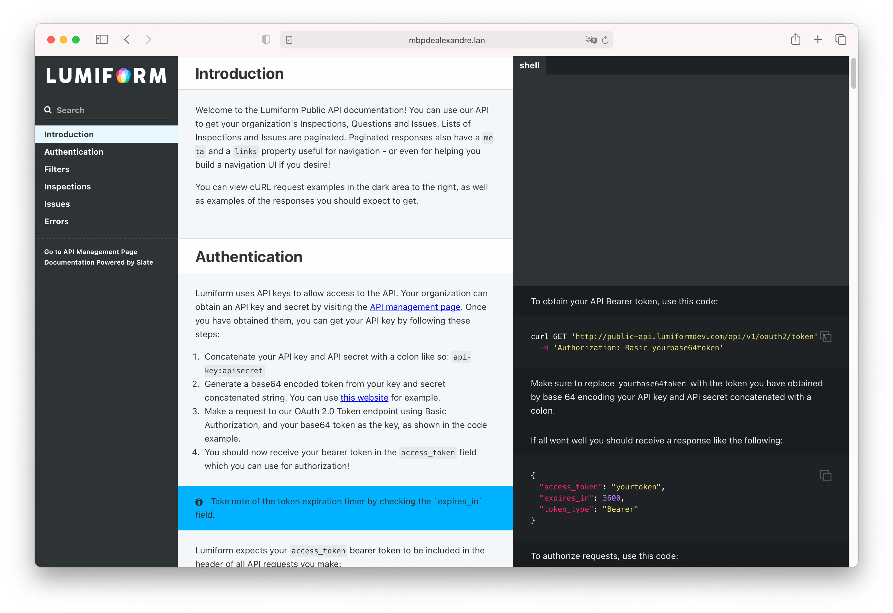

  

The Lumiform Public API documentation.

Setting up
----------
- Clone this repository to your local machine and follow Slate's [installation instructions](https://github.com/slatedocs/slate/wiki/Using-Slate-Natively). It should be
   pretty straightforward, but you may have to contend with Ruby and some writing permissions.
- Review the [markdown syntax](https://github.com/slatedocs/slate/wiki/Markdown-Syntax) used in the documentation. It should be extremely easy to pick simply by observing the
   markdown and the placement of each section.
- Run the  `bundle exec middleman server` command to launch a small server for previewing your changes. You will need to refresh the browser on each change.
- You're all set!
   
You can also run the  `bundle exec middleman build` command to generate the static assets locally and preview them or send them over to your teammates.

Deploying
----------
After pushing your changes to the `main` branch, simply run ` ./deploy.sh`

This will build and push the static assets to the `gh-pages` branch, which GitHub uses to host the documentation.

Finally, in the repository, head over to `Settings` > `Pages` and in the "Custom Domain" field add the following URL:
`developer.lumiformapp.com`. For now, this must be done manually,

Support & Troubleshooting
----------
Check the [original Slate documentation](https://slatedocs.github.io/slate) or ping a member of the Web development team.

We'll be happy to help!
